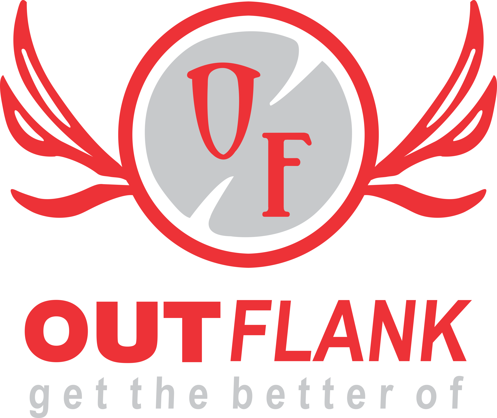

<div align="center">
  
  
  # 🚀 Outflank Corporate Gifting
  
  **A premium, high-performance corporate gifting e-commerce platform built with Next.js 16, Tailwind CSS v4, and Supabase.**

  [](https://nextjs.org/)
  [](https://react.dev/)
  [](https://tailwindcss.com/)
  [](https://supabase.com/)
  [](https://www.framer.com/motion/)

</div>

---

## ✨ Features

- **Modern Premium Storefront:** A beautiful, responsive user interface designed for corporate clients to explore catalogs and inquire about products.
- **Admin Dashboard:** A fully protected internal CMS to manage categories, products, banners, and review corporate leads.
- **Full-Stack Next.js 16 (App Router):** Leveraging Server Components, Server Actions, and dynamic routing for incredible performance.
- **Supabase Backend:** Secure database integration, storage buckets, and authentication for the admin panel.
- **Dynamic Catalog:** Browse through different gifting categories like Employee Kits, Tech Accessories, Drinkware, and more.
- **Lead Capture System:** Built-in modal forms for corporate clients to request quotes and bulk orders directly into the database.
- **Rich Animations:** Smooth page transitions and micro-interactions powered by `framer-motion`.

## 🛠️ Tech Stack

- **Framework:** [Next.js 16](https://nextjs.org/)
- **Language:** TypeScript
- **Styling:** [Tailwind CSS v4](https://tailwindcss.com/)
- **Database & Auth:** [Supabase](https://supabase.com/)
- **Animations:** [Framer Motion](https://www.framer.com/motion/)
- **Icons:** [Lucide React](https://lucide.dev/)
- **Email:** Node.js + Nodemailer

## 🚀 Getting Started

Follow these steps to run the Outflank platform locally on your machine.

### 1. Clone the repository
```bash
git clone https://github.com/outflank12/outflank-website.git
cd outflank-website
```

### 2. Install dependencies
```bash
npm install
# or
yarn install
```

### 3. Setup Environment Variables
Create a `.env` file in the root directory and add your Supabase and Email configurations:

```env
NEXT_PUBLIC_SUPABASE_URL=your_supabase_url
NEXT_PUBLIC_SUPABASE_ANON_KEY=your_supabase_anon_key
SUPABASE_SERVICE_ROLE_KEY=your_supabase_service_role_key

SMTP_USER=your_email
SMTP_PASSWORD=your_email_app_password
```

### 4. Run the development server
```bash
npm run dev
# or
yarn dev
```

Open [http://localhost:3000](http://localhost:3000) with your browser to see the storefront. 
To access the admin panel, navigate to `/admin/login`.

## 📂 Project Structure

- `app/(storefront)/`: The client-facing corporate gifting website.
- `app/admin/`: The protected admin dashboard for content management.
- `app/api/`: API routes for server-side logic (leads, etc).
- `components/`: Reusable React components (catalog, layout, UI).
- `lib/supabase/`: Supabase client and server configuration utilities.
- `scripts/`: Assorted scripts for database migrations, seeding, and bulk uploads.

## 📄 License

This project is proprietary and confidential.

---
<div align="center">
  <i>Built with ❤️ for Outflank Corporate Gifting.</i>
</div>
